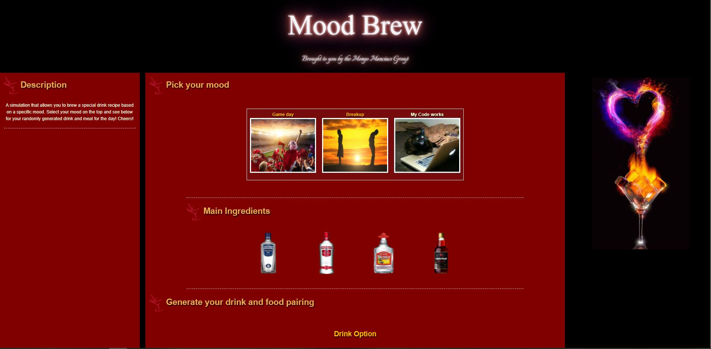

# Mood Brew
For our project, we have created a drink and food generator based on your mood. There are 3 mood options on the top of our interface. When a user selects a mood category, they will then receive 2 alcohol options catered to that specific mood. A coin flip API will randomly select their type of alcohol. Once alcohol is selected a randomly generated drink and food option appears.

## User Story
```
AS A coder I want to relax after a long day
I WANT to randomly generate a drink option that matches my mood for the day
SO THAT I don't have to worry about choosing on my own
```

## Application Requirements

```
Your project should fulfill the following requirements:

Use a CSS framework other than Bootstrap.

Be deployed to GitHub Pages.

Be interactive (i.e., accept and respond to user input).

Use at least two server-side APIs.

Does not use alerts, confirms, or prompts (use modals).

Use client-side storage to store persistent data.

Be responsive.

Have a polished UI.

Have a clean repository that meets quality coding standards (file structure, naming conventions, follows best practices for class/id naming conventions, indentation, quality comments, etc.).

Have a quality README (with unique name, description, technologies used, screenshot, and link to deployed application).
```

## Technologies Used
```
HTML
CSS 
FOUNDATION
JAVASCRIPT
```


## Example ScreenShot of Start Screen


## Example ScreenShot of Outcome after Drink is Generated


## Example ScreenShot of Local Storage
 

## Link to Deployed Application

[Click Here!](https://kaileesmith.github.io/Mood_Brew/)